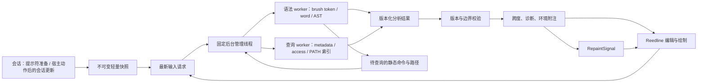

# 实时输入解析与输入辅助设计

本文是 nosh 自身交互 REPL 的实时输入解析设计，功能名与代码模块统一为 **输入辅助（`input_assist`）**。覆盖结构高亮、待完成输入、语法诊断、命令识别、路径状态及故障降级；不以“仅上色”替代完整输入提示。

关联需求：#22；缩写识别契约关联 #28。总体架构、提交路由和审批边界见 [主设计文档](DESIGN.md)。

## 1. 范围与不可破坏的约束

- 默认启用，不依赖插件、模型、联网。分析与显示不自动改写输入；可信本地纠错仅由用户明确按右方向键回填草稿，可撤销，不提交、不执行、不新增审批。
- 不调用 shell 展开器、命令替换、补全函数、探测 shell 或任意程序的 `--help`；不能因显示诊断加载 rc、模型或下载资源。
- 分析慢、文件系统不返回、锁竞争和 worker 故障不能阻塞编辑、退格、取消或退出。**停止等待不等于任务已停止；未回收任务继续占额度。**
- 不更换 brush / Reedline，不另写一套 Bash 语法引擎，不建设增量 AST 框架或通用插件总线。
- 真正提交仍经过原有 `LineValidator`、AI 路由及适用的权限审批；诊断暂停不能绕过它们。
- 只面向 Linux/WSL 和 macOS 的现有 shell 支持范围。非 TTY、基本终端、脚本、`nosh -c` 和 agent 直接执行不进入实时分析通道。
- 不宣称解决所有用户钩子、主动补全脚本或实际执行命令的阻塞，也不证明某条命令一定成功或符合用户意图。

## 2. 分层与数据流

### 本地纠错采用

只对当前版本已确认缺失的静态命令推荐。复用本地 spell 排序和已有 PATH 索引，优先唯一相邻换位；其它情况只接受唯一的一次编辑距离、常用命令候选。模糊、多义、动态、PATH 覆盖或前序可能改变快照的输入不猜测。索引名称不等于可执行证据：闲置后由原查询 worker 再确认候选（内建/别名/函数来自同一会话快照），不在按键上查文件、不触发模型或补全脚本。

显示出采用键且普通编辑、光标在完整草稿末尾、无选区时才可采用。使用原生的选择跨度＋插入操作，保留简单命令引号、参数、Unicode 和后续命令；复杂拼接的命令词不编造替换跨度。会话/输入版本和独立按键批次 epoch 同时校验：即便同批按键尚未重绘，较早的输入、移动、选区、菜单、搜索或缩放也会使旧推荐失效。迟到结果不覆盖新草稿。

可见纠错与历史灰字互斥；不适用时右方向键仍走原移动/菜单/历史行为。AI 全局关闭仍可本地纠错；状态行关闭或无法显示采用提示时不隐藏历史、不暗中改键义。提交检查、权限和输出采集边界保持原样。



### 2.1 编辑线程

高亮回调只做有界文本变化检测、非阻塞请求合并、已完成结果读取和原文样式拼接。不做 brush 解析、文件查询、worker 启动或等待，不获取可能阻塞的 shell/后台锁。

文本不变时复用结果。光标、选区、配色或普通重绘只改变展示；**不重复分词或查文件**。超大输入不复制进分析队列，保留完整可编辑原文并显示分析限制。Reedline 必需的原文复制和渲染成本仍随文本增长，不能声称任意长度输入的绘制是常数开销。

结果到达后使用 Reedline 0.52.0 的 `repaint_signal()`，不打印空白消息、不模拟按键。沿用其事件循环的信号检查，不为动画设置高频重绘；后台管理线程只在工作进行时短间隔检查，空闲唤醒不解析或扫描文件系统。

### 2.2 语法 worker

使用 brush-core 0.5.0 / brush-parser 0.4.0 的公开接口：

| 接口 | 用途 |
|---|---|
| `Shell::parser_options()` | 取得当前 shell 的解析选项，不克隆整个 shell |
| `uncached_tokenize_str` | 分词，避免额外整行 tokenizer 缓存 |
| `parse_tokens` | 复用同一组 token 构建 AST，不重复分词 |
| `word::parse` | 字符串、变量、替换等 word pieces 及静态字面值 |

现有 brush tokenizer 对未闭合输入会返回错误而不保留完整部分 token 流。当前实现使用真实错误原因和实际位置，只对可信的原文前缀尝试一次恢复；未完成词不冒充完整参数。尾管道可分析真实完整的左侧 program。**不补引号、不拼虚构分隔符、不伪造整行成功 AST**；没有位置或不能可靠分解的尾部不编造精确跨度。

完整语法、静态遍历及 word 解析都在 worker 内进行，即便输入很短。短输入不保证 parser 必定及时返回；当前未引入 brush 本地补丁。

nosh 前缀命令复用本地命令目录。草稿末尾的有效子命令前缀（如 `#s`、`#mo`）标为待完成，不报未知命令；完整未知名称、已追加空白或参数的未知名称仍明确报错。这仅影响未提交草稿的反馈，提交时仍要求完整命令名，不把缩写自动当成合法管理命令。

### 2.3 查询 worker

只处理语法分析明确提取的静态命令/路径，不执行输入。命令查询和文件查询串行复用同一 worker、缓存及 backend PATH 索引；文件系统调用即使卡住，也不占用编辑线程或语法 worker。

查询结果是**当前快照事实**。存在不等于可读写，具备执行访问权限不等于解释器存在、运行必成功或已获审批。

### 2.4 数据契约

| 类型 | 职责 |
|---|---|
| `Version { input, session }` | 输入内容版本和会话快照版本；旧结果不能给新输入着色 |
| `Context` | cwd、PATH、必要目录变量、启用 builtin、alias/function 名称、hash、解析选项、相关 trap、AI 与缩写状态 |
| `Analysis` / `Span` | 原文跨度、结构角色、静态诊断及有界查询目标 |
| `Query` | 静态目标、用途、原文范围，以及前序行为是否可能改变事实 |
| `Observation` | 命令/路径结论及查询完整性，不包含执行授权 |
| `Finding` | 确定的状态、原因、原文范围；不通过“空错误列表”冒充已全面检查 |

## 3. 判定、环境附注与显示强度

这三者必须独立：**权限拒绝不总是未知，未知也不等于错误；光标位置不能改变已有结论。**

| 状态 | 语义 |
|---|---|
| 已识别 | builtin、alias、function、外部命令、可用缩写或存在路径等事实；不是安全承诺 |
| 待完成 | 未闭合引号、尾管道、括号或多行结构；继续编辑，不把整行标红 |
| 输入错误 | 有依据的语法错误、已确认无法执行/访问必要路径，或已排除所有可执行候选 |
| 未知 | 动态解析、前序行为、真正的 I/O 故障等使信息不足 |
| 查询中 | 当前版本的分析或查询尚未完成 |
| 诊断暂不可用 | 超预算、快照不可得、worker 故障或超时；不伪装成无错误 |

未找到命令词时，原有反馈使用红色删除线，不再按“正在输入/离开词/其他错误”切换多套样式。停止输入约 1 秒后才显示；配置启用状态栏时，复用同一个延迟决定和 `Finding` 事实补充文字原因，`NO_COLOR` / `CLICOLOR=0` 下也可读取。关闭状态栏时保留原有展示行为。不会因光标移动或状态重绘重新查询。

诊断文字位于输入行上方，保留 PS1/PS2、历史建议、补全菜单及 AI/YOLO 标记。状态区只允许一行显示，转义控制字符和换行，按当前列宽裁剪。

上方信息条采用环境、状态、操作提示、模式附注四区，InputAssist 的主反馈与原因进入状态区，旧固定底栏已移除；自定义 PS1/PS2 不拆改。复用原反馈、版本检查和延迟，并提供类型化、与当前输入匹配的完整文字和短摘要，不从已裁剪的本地化文字反推状态。菜单/搜索暂时替代旧草稿反馈，返回编辑后恢复；关闭信息条保留原反馈契约，不另做一份分析。字段、case 与实际验证范围见 [状态行设计](STATUS-BAR.md)。

## 4. 命令与路径规则

### 4.1 命令解析与权限

按当前作用域与会话状态识别 alias、function、实际启用的 builtin、可用缩写和外部命令。显式命令路径、临时 PATH、相对/空 PATH 项、cwd 及 shell hash 都影响查询；索引中的候选名不是存在或可执行的证明。

执行访问检查与 brush 使用相同的真实用户 `access(X_OK)` 语义，但保留 errno，不将所有失败折叠成 false：

| 证据 | 结论 |
|---|---|
| 找到可执行候选 | 正常识别，即使其他 PATH 目录不可访问 |
| 显式命令路径被确认无执行/目录搜索权限 | 错误：“当前用户不可执行此路径” |
| 所有静态候选均缺失或确定不可执行 | 错误：“当前用户未找到可执行命令”；不声称文件不存在 |
| 真正 I/O 故障、动态名称或上下文不确定 | 未知 |
| 未查完即达预算上限、超时或 worker 故障 | 暂不可用，不得报告“不存在” |

PATH 候选出现权限拒绝后，确认目录本身是否可搜索。目录级拒绝缓存在现有有界缓存里，避免每输入一个新前缀就查询同一受限目录。**不可列目录不等于不可搜索目录**；仅某个文件拒绝访问，也不能封锁整个可搜索目录。

受限目录不会覆盖命令结论，也不会请求提权、删除 PATH 项或改变实际 shell 环境。目录详情不在默认编辑界面展示。

### 4.2 作用域与副作用

`command_context` 共享无 I/O 的静态词语、赋值、函数/PATH 作用域合并及副作用规则；诊断与提交路由各自消费这些事实，不互相调用完整流水线。

- 当前行函数定义按顺序生效，不提前到定义前；子 shell/异步作用域不向外泄漏确定定义。
- 条件定义、条件 PATH 变化、动态命令、`source` / `eval` 等保持保守，不用旧全局索引下否定结论。
- `:` / `true` / `false` / `echo` / 非 `-v` 的 `printf` 只有在确认为原生 builtin、无相关副作用参数/重定向/trap 时，才不使后续文件事实失效。
- 同名 alias/function、外部命令、替换及 DEBUG/ERR/RETURN trap 不享有上述例外。算术/参数中可能的赋值或命令运行也不能按纯字面值处理。
- 普通变量和 glob 不因“无法求出字面值”就等同于运行任意程序；复杂部分只作保守标记，不主动展开。

提交时保留既有本地拼写建议和明确自然语言分流。例如 `ls && gti push` 仍可建议替换，但不会自动执行；前序可能创建命令、且不能纠错的运行时不确定项交回正常 shell，而不是仅凭旧快照转交 AI。边界见 [主设计 §4.2](DESIGN.md#42-ai-触发与输入判定)。

### 4.3 路径与重定向

| 输入 | 规则 |
|---|---|
| 普通字面参数 | 有界检查“是否也是存在路径”；缺失不报文件错误 |
| 显式路径、`cd`、输入/输出重定向 | 按位置语义检查类型和当前状态，保留查询错误 |
| `echo hello > new.txt` | 允许新输出目标，不因缺失报错，也不保证可写 |
| `touch input; cat < input` | 前序可能创建文件，不能判后续必失败 |
| `> input; cat < input`、`cat > input < input` | 按顺序传播创建副作用，不误报后续读取 |
| `cat < missing > missing` | 后面的创建不能修复之前的输入重定向 |
| `cat < ''`、`cd ''` | 空路径不是当前目录 |
| metadata 被拒绝但读取检查并未拒绝 | 保留未知，不把属性访问失败当成读取无权限的证明 |

只用快照解释可确定的简单 `~` 目录，不查用户数据库、不调用 shell 展开器。动态变量、glob、`~user` 等不静态求值。存在路径的下划线仅表示快照事实。

### 4.4 AI 与缩写

配置前缀统一识别 `#subcommand`、裸前缀帮助与 `# 任务`，具体形式随 `ai_prefix` 改变。管理名称和参数使用同一共享目录本地验证，错误直接显示，不查 PATH、文件路径或执行参数；自然语言正文标为 AI。`ai` 与其它普通 Shell 命令一样分析，无专用头部查询或二次解析。AI 禁用时不识别前缀，保留单词内撇号及自动路由暂停的既有边界。

U6 的 `Abbreviations` 只接收规则所有者已确认“启用且适用”的名称及版本。缩写是独立角色，不冒充同名外部程序；本项不实现规则管理、内置规则、展开、撤销或键位。#28 负责最终组合验收。

## 5. 快照、缓存与版本

快照在进入提示符以及宿主动作后的用户会话更新时刷新。补全现在使用独立快照，不将脚本改动写回用户 shell，所以单纯补全或菜单导航不重新读取用户 shell。采集只做有界内存工作，不复制完整环境、函数正文或持 shell 锁进行 I/O；锁忙、动态值或截断必须显式降级。两功能共享有界 IPC／资源限制基础，但补全不占用输入分析 worker，详见[补全说明](COMPLETION.md)。

结果同时匹配输入与会话版本。内容变更仅保留最新待处理任务；发布前验证结果版本、帧大小、跨度边界与查询对应关系。光标不属于分析缓存键。

文件缓存的时效只在后续编辑/请求时检查，返回提示符时失效。PATH 候选索引复用 backend 存储，以 cwd/PATH 为键并携带完整性原因；不在每个按键扫描 PATH、不做空闲目录树扫描。相关 alias/function、启用 builtin、选项、hash、AI 或缩写状态变化通过新快照使结果失效。

## 6. 进程隔离与生命周期

每会话最多两个本功能拥有的 worker：语法一个、查询一个，另有固定后台管理线程。每能力并发 1，只保留一个最新待处理请求；不能按键创建线程/进程。

worker 通过 nosh 隐藏内部入口，在配置、rc、模型和交互 shell 初始化前分流。不继承交互终端，不通过 argv/环境变量传输入正文，仅通过本地有界 IPC 传必要数据。嵌入宿主显式提供 `WorkerCommand` / `run_worker_from_env`，不假定测试宿主的 `current_exe()` 就是 nosh。

管理线程在首个**有效**会话快照写入、邮箱锁释放之后才触发一次启动；
`InputAssist` 的克隆共享同一启动标记。初次快照失败时明确显示不可用，
不提前启动线程；后续有效 `prepare()` 仍可完成初始化。启动失败保留诊断错误，
不在按键路径反复启动线程。之后仍使用非阻塞更新和原有故障退让，
不在编辑线程等待 worker。确定性回归覆盖初始启动顺序，以及首次请求的
强制邮箱竞争后保留上下文并完成真实 worker 分析。

单缓冲编码 IPC，快照校验计数而不构建临时 JSON 副本；每轮收发有界，中断重试不递归。worker 正常退休时，父进程先排空已写出的结果，再处理 EOF，避免把正常退出误报为丢失结果。

| 情况 | 处理 |
|---|---|
| 输入更新 | 合并待处理请求；旧结果作废；不等待旧任务 |
| 请求超时/协议或进程失败 | 暂停该能力并请求停止；仍须确认退出才释放额度 |
| worker 未回收 | 保持占位，不启动替代任务突破并发上限 |
| 首次故障后已回收 | 下一快照刷新允许最多一次自动重启 |
| 再次故障 | 暂停至新会话，避免循环重启 |
| 输入超出内容预算 | 只暂停该输入；缩短后可恢复 |
| 主动退休 | 完成当前响应后退出，回收后替换，不算故障重试 |
| 取消/退出 | 只处理持有的子进程句柄，不扫描/误杀用户任务，不无界 join、drain 或 wait |

所有启动路径都登记退出句柄，包括只有语法或索引预热的情况。极端内核 I/O 阻塞可能使终止请求不能立即回收进程；不能把发送 kill 写成“已经清理”。

## 7. 内部资源预算

以下是实现边界，不是要求用户调优的选项，也不是所有设备上的延迟承诺。

| 项目 | 边界 |
|---|---|
| 并发/队列 | 2 个 worker、1 个管理线程；每能力 1 执行中 + 1 最新待处理 |
| 输入、快照、静态 word | 256 KiB、256 KiB、8 KiB；超限不截断编辑缓冲区 |
| 分析 | 16,384 token / 自身遍历节点、64 层自身遍历、4,096 初始跨度 |
| 查询/样式叠加 | 每版本 64 目标，最多另增 128 个边界跨度 |
| 文件缓存 | 512 项且计费 2 MiB，时效 1 秒，仅后续请求刷新 |
| PATH 索引 | 128 目录、65,536 已访问条目、16,384 名称、4 MiB 名称文本；截断标记不完整 |
| IPC | 每帧 8 MiB；长度先检查，每轮传输分块有界 |
| 请求期限 | 语法 250 ms、文件/命令查询 500 ms、PATH 索引 1,500 ms |
| CPU / 栈 | 逐请求更新 CPU 软限制，约 1–2 秒 CPU 余量；栈至多 4 MiB，保留更严格的继承限制 |
| 内存 | 初始虚拟空间 + 128 MiB；验证超额映射确实被拒绝，不只相信 `setrlimit` 返回成功 |
| 备用分配预算 | OS 地址空间限制不足时累计计费 128 MiB，不退还释放额度；完成请求后余量低于 64 MiB 主动退休 |

自身 AST 遍历深度限制不是对 brush 内部递归的证明，故解析仍须进程隔离。

macOS 宿主安装 `WorkerAllocator`；普通 shell/模型分配仍使用 `System` 且不开预算，内部 worker 直接使用该累计分配预算。不能可靠限制且宿主未安装分配器时明确暂停。累计计费避免释放后的 arena 滞留/碎片绕过资源约束；128 MiB 不是跨平台进程 RSS 总额承诺。

## 8. 坐标与终端兼容

brush token 的 `SourcePosition.index` 是字符索引，转换成原文 UTF-8 字节范围后才交给 Reedline。word 局部字节偏移单独处理；终端裁剪再使用字素和显示列宽，不能混用。

跨度拼接必须逐字节保留原文，不能将变长的转义文本塞回输入缓冲区。诊断文字单独清理。覆盖中文、非 BMP、组合字符、ZWJ emoji、Tab、多行、行中编辑、粘贴、选区与窄窗口；反向历史搜索隐藏旧输入诊断。

`NO_COLOR` / `CLICOLOR=0` 关闭输入样式；配置启用状态栏时，命令未找到的文字原因仍在既有反馈区可见。`TERM=dumb`、`unknown`、缺失 TERM 或非 TTY 沿用基本/非交互路径，不启动实时分析 worker。窗口尺寸从编辑器事件更新。

## 9. 配置与代码入口

```toml
[shell]
input_assist = true
```

设置 `false` 同时关闭该实时分析与展示通道。`--safe` / `NOSH_DISABLE_AI=1` 不关闭它；正常的 shell 提交行为不受总开关替代。

| 代码 | 职责 |
|---|---|
| [`input_assist/mod.rs`](../crates/nosh-shell/src/input_assist/mod.rs) | 数据契约、预算、配置与宿主启动接口 |
| [`analysis.rs`](../crates/nosh-shell/src/input_assist/analysis.rs) | brush 分析、结构跨度、语法/静态状态、查询提取 |
| [`lookup.rs`](../crates/nosh-shell/src/input_assist/lookup.rs) | 权限/路径查询、有界缓存、PATH 索引及环境附注 |
| [`editor.rs`](../crates/nosh-shell/src/input_assist/editor.rs) | 最新请求、版本发布、worker 调度、显示及生命周期 |
| [`worker.rs`](../crates/nosh-shell/src/input_assist/worker.rs) / [`allocation.rs`](../crates/nosh-shell/src/input_assist/allocation.rs) | IPC、进程管理、OS 限制与备用分配预算 |
| [`command_context.rs`](../crates/nosh-shell/src/command_context.rs) | 输入与提交共用的纯静态事实 |
| [`backend.rs`](../crates/nosh-shell/src/backend.rs) / [`trigger.rs`](../crates/nosh-shell/src/trigger.rs) | 轻量会话快照、共享索引、提交时作用域/路由 |
| [`repl.rs`](../crates/nosh-shell/src/repl.rs) | Reedline 接入、提示符、取消与退出 |
| [`editing.rs`](../crates/nosh-shell/src/editing.rs) | 实际 Emacs/Vi 与输入焦点键表；InputAssist 包装通用 EditMode 并转发模式事件，保留纠错采用的同批 epoch 检查 |
| [`config.rs`](../crates/nosh-cli/src/config.rs) / [`main.rs`](../crates/nosh-cli/src/main.rs) | 总开关及内部 worker 入口；配置必须全链路接通 |

## 10. 验证与对照

### 10.1 自动回归

复用 [shell 测试](../crates/nosh-shell/tests)、[输入辅助用例](../crates/nosh-shell/src/input_assist/tests.rs) 和 [真实 PTY probe](../crates/nosh-core/tests/terminal.rs)，不依赖真实模型。

验收包括完整/未完成语法、AI 入口与禁用、作用域/临时 PATH、权限拒绝与其他 I/O 故障、重定向顺序、无副作用 builtin/覆盖/trap、原文字节与 Unicode、光标不触发查询、旧结果丢弃、损坏/超大 IPC、长期阻塞、不可回收额度、有限重试和取消/退出。

PTY 按步骤发送输入并观察结果，不能只“一次性送入所有按键，最终成功”。阻塞用例必须在 worker 未释放且未到期限时完成编辑、退格、Ctrl-C 和 Ctrl-D；测试自身有独立 watchdog。

### 10.2 可复现测量入口

```bash
cargo test -p nosh-shell --lib input_assist --locked -- --ignored --show-output --test-threads=1
cargo test -p nosh-core --test terminal input_assist_latency_comparison --locked -- --ignored --show-output --test-threads=1
cargo test -p nosh-core --test terminal input_assist_blocked --locked -- --show-output --test-threads=1
```

测量使用同一构建、硬件、终端尺寸和输入，分别记录开/关状态、逐键编辑、整行替换、首次绘制和 worker 成本。报告注明采样间隔、样本数和离群值；低于观察器分辨率的差异不能解释为提速，共享页不能重复计为物理内存增量。

## 11. 当前限制

终端删除线、颜色和字形显示受宿主能力影响；已启用的状态栏在 `NO_COLOR` 下仍须保留文字原因。命令未知约一秒的延迟和搜索恢复属于当前契约，不随显示层调整改变。环境目录的完整详情不在默认编辑界面展示，宿主兼容范围见[状态行设计](STATUS-BAR.md#6-已知限制)。
